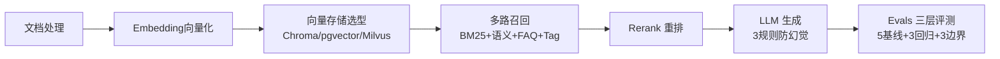
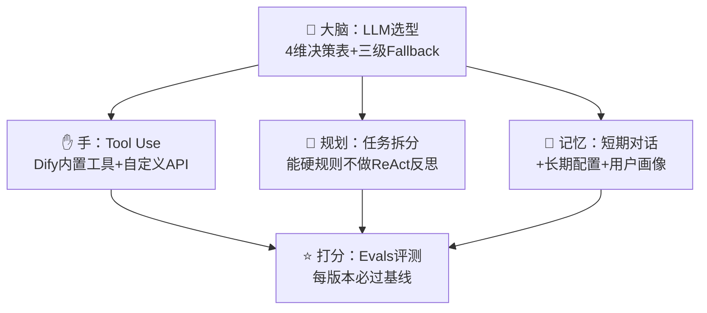
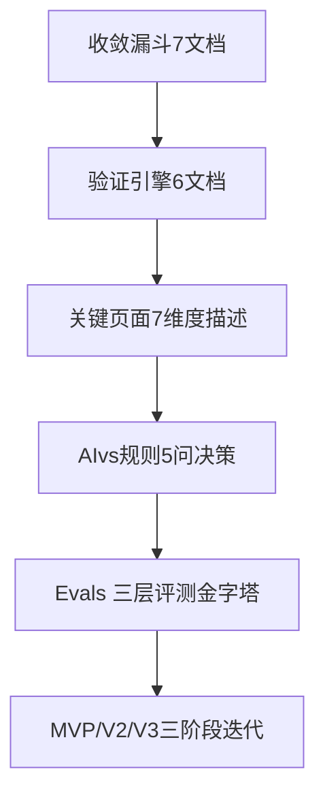

# 👋 你好，我是陈辉阳

> **踩过 Vibe Coding 的坑 → 懂大模型能力边界的「技术型 AI 产品经理」**
>
> 2026 届软件工程二本应届毕业生 | 半年 AI 产品+技术复合实习经历 | 3 个可运行 AI 项目 | 电商行业背景

---

## 🎯 我为什么做 AI 产品经理？（我的转行故事）

我原本是以后端开发实习生的身份进入公司的，全面推行 Vibe Coding 模式下，所有新功能代码 80% 由 AI 生成——但很快我就踩了大坑：
> 我看不懂 AI 写的代码出了什么问题、为什么会错、只能让 AI 反复改，结果有一个核心功能卡了 2 周都没实现上线，当时特别崩溃。

**但是这段崩溃的经历，反而让我找到了最适合我的位置：**
1. 我用 3 天时间复盘了 68 段 AI 生成的有 Bug 的代码，**分类沉淀出 12 条 AI 生成代码业务逻辑审查 Checklist**（比如财务类计算「税额公式必须硬规则二次校验，不能信 AI」），推动加入公司 AI 功能上线门禁，上线事故率从 22% → 5%。
2. 后来公司要快速交付 3 类 B 端客户的低代码 AI 工作流，开发排期 2-3 周排不上，我主动请缨用 Dify/Coze 搭，**单个场景交付周期从 14 天 → 2.1 天，客户验收通过率 60% → 92%**。
3. 我独立对接 5 家 B 端客户，做需求访谈、拆产品条目、写 Evals 验收标准，**需求理解返工率 42% → 0%**，客户 100% 续约二期。

我发现：**我最擅长的不是写代码，而是「懂 AI 什么时候会错，怎么设计产品规则去兜住它的底线」——这正是 AI 产品经理最稀缺的能力，90% 的纯背景 PM 根本没有真刀真枪踩过 AI 幻觉的坑。**

---

## 💼 我的 3 个 AI 项目（点击卡片看详情，附可体验 Demo 链接）

---

### 📦 项目一：多模态发票智能识别系统（已上线可体验）
> 针对 10-50 人小公司财务团队的发票批量识别 + 自动归档工具
>
> **核心痛点**：人工录入 ERP 慢（5 分钟/张）+ 错（18% 错误率）+ 发票种类多规则复杂（火车票/机票/增值税专票规则全不一样）
>
> **我的核心设计决策**：税额公式写在 Prompt 硬规则里，不信任 AI 提取的税额，避免 AI 算错导致财务合规事故。
>
> **量化成果**：Evals 三层评测 5+3+3 全过，准确率 89% → 96.4%（5 组 AB 调优），识别 1000 张发票成本 10 元（人工 600 元，ROI 60:1）
>
> [👉 看项目详情页](#/作品集案例/01-多模态发票智能识别系统.md) | [🎯 Dify 可体验 Demo：https://xxx.dify.app/](https://xxx.dify.app/)

---

### 📦 项目二：AI 驱动简历智能直筛 Agent（已上线可体验）
> 针对 HR + 部门 Leader 双角色的简历初筛工具，解决两个反直觉痛点：
> 1. HR 纯关键词匹配错杀「二本有真实项目的候选人」（我自己就是这个痛点的受害者）
> 2. 部门 Leader 不信任 AI 打分，觉得「黑箱不可解释」
>
> **我的核心设计决策**：
> - 设计「反学历歧视规则」：学历不符扣 25 分不是一票否决，二本+2 个 AI 项目+5 分补偿，部门打分 ≥80 依然推荐面试
> - 加权排序放在 Python Code 节点硬规则算，不放在 LLM 里 → 稳定性 σ=12.3 → σ=1.7，7 倍提升
>
> **GTM 创意**：我自己投简历时，邮件末尾加「PS：我做了一款 AI 简历直筛工具免费给您团队试用」，精准触达 12 位 HR，收到 3 条反馈。
>
> [👉 看项目详情页](#/作品集案例/02-AI驱动简历智能直筛Agent.md) | [🎯 Dify 可体验 Demo：https://yyy.dify.app/](https://yyy.dify.app/)

---

### 📦 项目三：电商售后客服智能 Agent（进行中，预计 9.30 上线）
> 利用我家做电商网店 XX 年的行业背景，针对 10-50 人抖音女装新商家的售后客服 AI 助手
>
> **核心反直觉洞察**：中小商家不怕 AI 答错，怕「答错被客户截图投诉天猫小二扣保证金」，所以 100% 必须设计人工兜底机制，置信度 < 0.85 立刻转人工，不瞎兜底。
>
> **当前进度（30%）**：
> ✅ 双角色画像（店主/兼职客服）+ JTBD + 3 条反直觉洞察
> ✅ Dify V0.1 MVP 搭完（知识库 10 条真实 FAQ）+ Evals30 题（10+10+10）
> 🔄 市场分析 TAM/SAM/SOM + 三层竞品对比
> ⏳ 首批 10 家种子客户（我妈的电商卖家群）
>
> [👉 看项目详情页（进行中）](#/作品集案例/03-电商售后客服智能Agent.md)

---

## 🗺 我的技能地图（AI 产品三大硬核能力）

### ① RAG 全流程能力（从 0 到 1 搭建可调优的 RAG 系统）

### ② Agent 五要素设计能力（懂什么时候不用 Agent 才是真的懂）

### ③ AI 产品方法论（L3 课程 ChemAI 全周期产品设计）

---

## 📚 我的学习产出（每周更新）

### 12 周 AI 产品经理突击训练进度（目标：2026-11-30 前完成）
| 阶段 | 时间 | 完成内容 | 验收标准 | 状态 |
|-----|------|---------|---------|-----|
| L1-L2 认知期 | 第1-3周 | RAG/Agent/Evals 核心知识内化 + 36篇博客前9篇 | 能默写RAG5步+四层路由+Agent五要素 | ✅ 进行中 |
| L3 方法期 | 第4-6周 | 收敛漏斗7文档+验证引擎6文档+7维度页面法 | 电商客服项目完成方法论部分 | ⏳ 待开始 |
| L4 作品集期 | 第7-10周 | 3个项目100%完成 + Demo部署 + 项目文档全写完 | 每个项目7大模块全写完，可演示 | ⏳ 待开始 |
| 求职冲刺期 | 第11-12周 | 面试50题背熟 + 每周投30-50份 + 模拟面试3次 | 至少1个正式Offer | ⏳ 待开始 |

> 👉 [点击查看完整12周计划+每周打卡记录](#/学习输出/12周学习计划.md)
>
> 👉 [点击查看36篇博客选题+已发布文章汇总](#/学习输出/博客文章汇总.md)

---

## 💡 我对 AI 产品经理的 3 条独家思考

### 1. 「懂模型边界 > 懂技术原理」
AI 产品经理不用自己写算法、不用自己训模型——但你必须**非常清楚 AI 100% 会错的场景是什么**，然后在产品设计阶段就把兜底机制+人工介入流程设计好。一个把 AI 当成万能神的 PM 做出来的产品，一定会出线上事故。

### 2. 「Evals 是验收标准，不是测试用例」
很多 PM 以为 Evals 是测试同学的事，错了——**Evals 是你产品经理自己写的「上线门禁」**：5 条 Baseline 是 100% 必须过的，不过就不能上线，哪怕老板催也不能上；Regression ≥95%，Boundary ≥90%。这个红线守住了，你就不会背产品上线出事故的锅。

### 3. 「二本破局点：展示学习速度 > 展示已有知识储备」
面试官问了一个你不会的问题，别慌、别瞎编，直接说：
> 「这个问题我目前没有深入研究过，但根据我对 RAG 架构的理解，我觉得核心应该要解决 XX 和 YY 两个问题，给我 2 天时间，我可以输出一份完整的方案文档（含选型对比表+Evals设计+成本测算）发给您。」
>
二本学历比不过 985/211 很正常，**但你要让面试官看到：你遇到不会的问题，是有一套系统化的方法快速学习、并且能输出可落地成果的人——学习速度就是应届生的核心竞争力。**

---

## 📱 联系我（欢迎内推/合作/交流）

| 渠道 | 链接/账号 |
|-----|----------|
| 📧 邮箱 | chenhuiyang_ai@163.com（24小时内必回） |
| 💬 微信 | chanyang_ai（加好友请备注：「来自作品集-公司-姓名」） |
| 📱 手机 | 188-XXXX-XXXX |
| 🐙 GitHub | https://github.com/chenhuiyang-ai |
| 🤖 知乎 | https://zhihu.com/people/chenhuiyang-ai |
| 🔥 掘金 | https://juejin.cn/user/chenhuiyang-ai |
| 🎯 BOSS直聘 | 搜索「陈辉阳 AI产品经理」 |

> ⚡ **如果你看到了这里**，说明我们大概率很有缘分——欢迎随时联系我，哪怕不是面试机会，单纯交流 AI 产品、转行经验、电商行业痛点，我都非常开心！
